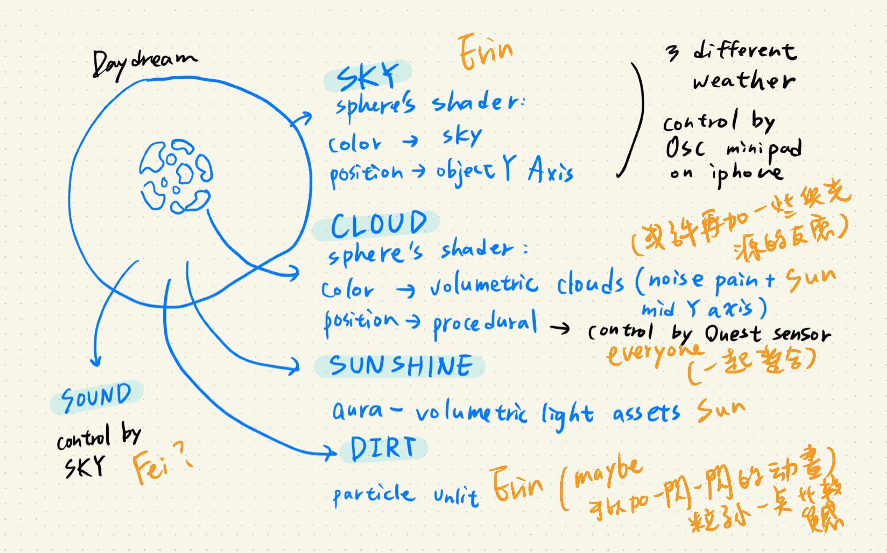
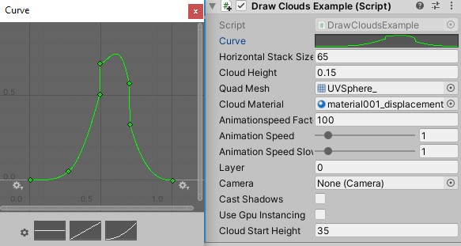
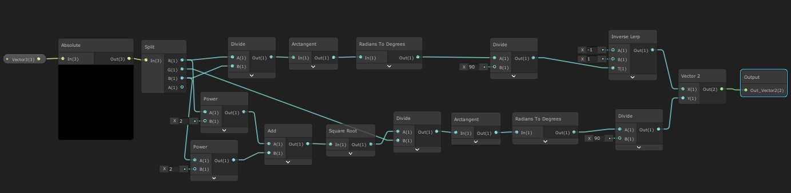
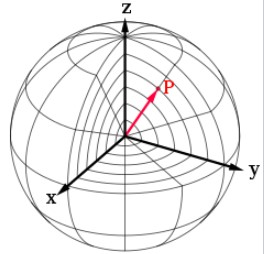

# 2020_habits_habitats_cloud
project name: Daydream

Inspired by habits and habitats. Changing of the nature is slow and slience, we want to speed it up and stronger the connection between human and envirnment by creating a virtual sky with customize stimulation. 

Step1. create Volumetric Cloud Shader into Alpha channel (shape and movement)
- pain two noise with different timing and scale

- control slower speed easlier with code 
-------------------------------------------------public Class
public float animationspeedFactor = 100;
[Range(0,10)] public float animationSpeed = 1;
[Range(0,10)] public float animationSpeedSlower = 1;

-------------------------------------------------void Update(){}
cloudMaterial.SetFloat("_animationSpeed", animationSpeed / animationspeedFactor);
cloudMaterial.SetFloat("_animationSpeedSlower", animationSpeedSlower /

Step2. create Procedural Shader into position channel (transform by VR sensor)
-Procedural

Step3. drawing a stack of Sphere in Cloud Material 
- draw stack by script
-------------------------------------------------public Class
public int horizontalStackSize = 20;
public float cloudHeight = 1f;
public Mesh quadMesh;
public Material cloudMaterial;
float offset;
public int layer;
public Camera camera;
private Matrix4x4 matrix;
private Matrix4x4[] matrices;
-------------------------------------------------void Update(){}
offset = cloudHeight / horizontalStackSize / 2f;
Vector3 startPosition = transform.position + (Vector3.up * (offset * horizontalStackSize / 2f));

if (useGpuInstancing) // initialize matrix array
{
matrices = new Matrix4x4[horizontalStackSize];
}

for (int i = 0; i < horizontalStackSize; i++)
{

// matrix = Matrix4x4.TRS(startPosition - (Vector3.up * offset * i), transform.rotation, transform.localScale);
matrix = Matrix4x4.TRS(startPosition, transform.rotation, new Vector3(CloudStartHeight, CloudStartHeight, CloudStartHeight) + new Vector3(i, i, i)*cloudHeight );

if (useGpuInstancing)
{
matrices[i] = matrix; // build the matrices array if using GPU instancing
}
else
{ 

Graphics.DrawMesh(quadMesh, matrix, mat, layer, camera, 0, null, castShadows, false, false); // otherwise just draw it now
}
}

-control transparent along object Y Axis with curve

-------------------------------------------------public Class
public AnimationCurve curve;

-------------------------------------------------void Update(){}
-------------------for (int i = 0; i < horizontalStackSize; i++){}
//make a gradient to be public and use the position to catch gradient for alpha to make different sphere have different alpha
float normalizedRadius = (float) i / horizontalStackSize;
float alphaValue = Mathf.Clamp01(curve.Evaluate(normalizedRadius));
-------------------for (int i = 0; i < horizontalStackSize; i++){}
---------------if (useGpuInstancing){}else{}
//assign different alpha to each sphere
Material mat = new Material(cloudMaterial);//define as new material
mat.SetFloat("_globalAlpha", alphaValue);//make a new tag to use in shader graphic

Step4. editing coordinate in C4D for the Model of the Sphere
-Model with different UV

-------------------------------------------------public Class
public Mesh quadMesh;

Step5. remap the Volumetric Cloud Shader with Sphere coordinate

The spherical coordinates of a point in the ISO convention (i.e. for physics: radius r, inclination θ, azimuth φ) can be obtained from its Cartesian coordinates (x, y, z) by the formulaer 

The coordinate in Unity3D y and z axis is opposite with mathematic. Also dig in to the different coordinate ex: 4 degree space.

-result didn't turn well, so our resulution is giving up the Sphere coordinate,and making second layer with some individuls cloud interacte with Procedural Shader. We also want to try out some function which can earase the cloud on the sky.
Step6. adding Sky and particle and light and sound

Reference:
Real-Time Rendering of Procedurally Generated Planets 
Florian Michelic
https://www.youtube.com/watch?v=i5uowweBeyI
https://cescg.org/wp-content/uploads/2018/04/Michelic-Real-Time-Rendering-of-Procedurally-Generated-Planets-2.pdf

Clouds for Unity3D
kode80
http://kode80.com/blog/2016/04/11/kode80-clouds-for-unity3d/index.html
https://github.com/kode80/kode80CloudsUnity3D/tree/master/Assets/kode80/Effects/Scripts

Volumetric Clouds Write-up
https://www.patreon.com/posts/volumetric-write-21646034

Sky download:
https://mega.nz/#F!rrhwgSjJ
!40XlW4GO4Db9OVXd9aqiEQ

